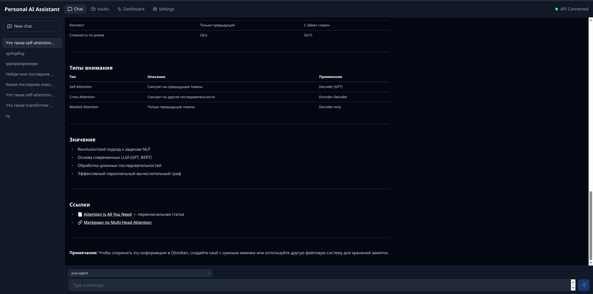

# Personal AI Assistant (PAA)

**Go-based cascading AI assistant with RAG, agent tools, Obsidian integration, and a Tauri desktop UI.**

**AI-ассистент на Go с каскадным поиском, RAG-пайплайном, интеграцией с Obsidian и десктопным UI на Tauri.**


[](https://polyformproject.org/licenses/small-business/1.0.0)

---

## Возможности

### AI Agent

- Каскадный поиск: база знаний (Qdrant) -> память LLM -> веб-поиск (SearXNG)
- Native function calling с автоматическим выбором инструментов
- Chain-of-thought рассуждения (блоки `<think>`, видны в UI как сворачиваемые секции)
- Intent router для классификации намерений пользователя
- Оркестрация инструментов: `knowledge_search`, `web_search`, `obsidian_write`, `task_tool`, MCP-инструменты

### RAG Pipeline

- Загрузка документов через API (multipart upload)
- Автоматическая классификация документов через LLM
- Чанкинг: фиксированный (`fixed`) и по структуре Markdown (`markdown`)
- Гибридный retrieval: семантический поиск + BM25 + reranking
- Query expansion (multi-query retrieval)
- Qdrant в качестве векторного хранилища

### Управление знаниями
- Синхронизация Obsidian vault: автоматическая по расписанию и ручная
- Создание заметок в Obsidian vault через агента
- Браузер vault с UI-управлением
- Поддержка нескольких vault одновременно

### Десктопный UI (Tauri)

- Чат с потоковой генерацией (SSE streaming)
- Отображение блоков `<think>` (chain-of-thought)
- Выбор модели и LLM-провайдера
- История разговоров с поиском
- Браузер Obsidian vault
- Дашборд со статистикой использования инструментов
- Настройки: тема, язык, модели, MCP-серверы, параметры агента
- Адаптивная верстка для мобильных устройств

### Память

- Краткосрочная: история разговоров в PostgreSQL
- Долгосрочная: векторные саммари в Qdrant (`conversation_memory`)
- Автоматическое суммирование каждые N ходов
- Retrieval релевантных воспоминаний при новых запросах

### Веб-поиск

- Интеграция с SearXNG (self-hosted метапоисковик)
- Автоматический fallback, когда в базе знаний нет ответа

### MCP (Model Context Protocol)

- Встроенный MCP-сервер (`/mcp`) для внешних клиентов (OpenWebUI, Claude Code, Cursor)
- Подключение к внешним MCP-серверам: filesystem, code-runner, GitHub
- Настройка через переменные окружения (JSON-массив)

### Инфраструктура

- Docker Compose для всего стека
- Поддержка хостового GPU (Ollama proxy через nginx)
- Несколько LLM-провайдеров: Ollama, OpenRouter, Groq, Together, Cerebras, HuggingFace
- Fallback LLM провайдер при ошибке основного
- Prometheus + Grafana + Alertmanager (дашборды, алерты)
- Rate limiting, backpressure, circuit breaker
- Retry с exponential backoff для внешних зависимостей
- CORS, structured JSON logging, request ID tracing

---

## Документация по архитектуре

- **[C4 Architecture (Context → Container → Component)](docs/c4/README.md)** — полная карта системы с Mermaid-диаграммами для каждой фичи
- **[Architecture & Business Logic](docs/architecture.md)** — описание бизнес-логики, пайплайнов и sequence-диаграммы
- **[ADR](docs/adr/)** — записи архитектурных решений

---

## Архитектура

```text
┌─────────────────────────────────────────────────┐
│               Desktop UI (Tauri)                │
│      React + Tailwind + Zustand + Vite          │
└──────────────────┬──────────────────────────────┘
                   │ HTTP/SSE
┌──────────────────▼──────────────────────────────┐
│              PAA API  (Go, cmd/api)             │
│   OpenAI-compatible /v1/chat/completions        │
│                                                 │
│   ┌──────────────┐    ┌───────────────────┐     │
│   │  Agent Loop   │    │  RAG Pipeline     │     │
│   │  (planner +   │    │  (query + rerank) │     │
│   │   tools)      │    │                   │     │
│   └──────┬───────┘    └────────┬──────────┘     │
│          │                      │                │
│   ┌──────▼───────┐    ┌────────▼──────────┐     │
│   │ Tool Router   │    │ Embedding +       │     │
│   │ knowledge     │    │ Generation        │     │
│   │ web_search    │    │ (Ollama / cloud)  │     │
│   │ obsidian      │    │                   │     │
│   │ task_tool     │    │                   │     │
│   │ MCP tools     │    │                   │     │
│   └───────────────┘    └───────────────────┘     │
└───────┬──────┬──────┬──────┬──────┬──────────────┘
        │      │      │      │      │
   ┌────▼──┐ ┌▼───┐ ┌▼───┐ ┌▼────┐ ┌▼───────┐
   │Qdrant │ │ PG │ │NATS│ │Olla-│ │SearXNG │
   │       │ │    │ │    │ │ ma  │ │        │
   └───────┘ └────┘ └────┘ └─────┘ └────────┘
```

**Worker** (`cmd/worker`) -- NATS-подписчик для асинхронной обработки документов: извлечение текста -> классификация -> чанкинг -> эмбеддинг -> индексация в Qdrant.

### Гексагональная архитектура (Ports & Adapters)

| Пакет | Назначение |
| ----- | --------- |
| `internal/core/domain` | Доменные модели (Document, Conversation, Task, Memory) |
| `internal/core/ports` | Inbound/outbound интерфейсы |
| `internal/core/usecase` | Бизнес-логика (ingest, process, query, rerank, agent_chat) |
| `internal/adapters/http` | HTTP-обработчики, OpenAI-compat API, SSE |
| `internal/infrastructure/` | Реализации: ollama, qdrant, postgres, nats, searxng, resilience |
| `ui/` | Tauri + React фронтенд |

---

## Быстрый старт

```bash
# Клонировать репозиторий
git clone https://github.com/<your-username>/PersonalAIAssistent.git
cd PersonalAIAssistent

# Создать файл конфигурации
cp .env.example .env

# Вариант A: Docker Ollama (CPU)
docker compose up -d --build

# Вариант B: Хостовый GPU Ollama
docker compose -f docker-compose.yml -f docker-compose.host-gpu.yml up -d --build

# Загрузить модели в Ollama
docker compose exec ollama ollama pull llama3.1:8b
docker compose exec ollama ollama pull nomic-embed-text
```

После запуска:
- **Tauri UI**: `http://localhost:1420`
- **OpenWebUI**: `http://localhost:3000`
- **API**: `http://localhost:8080`

---

## Разработка

```bash
# Тесты
make test

# Статический анализ
make vet

# Покрытие core + HTTP-адаптеров
make test-core-cover

# Перегенерация OpenAPI-кода
make generate

# Валидация конфигурации мониторинга
make monitoring-validate

# RAG evaluation suite
make eval
```

### UI (Tauri + React)

```bash
cd ui

# Vite dev server (только фронтенд)
npm run dev

# Полное Tauri-приложение
npm run tauri dev
```

### Один тест

```bash
go test ./internal/core/usecase/ -run TestQueryUseCase -v
```

### Spec-first API

OpenAPI-спецификация: `api/openapi/openapi.yaml`

```bash
# 1. Обновить спецификацию
# 2. Сгенерировать серверный код
make generate-openapi
# 3. Реализовать логику в internal/adapters/http/
# 4. Проверить
make test
```

---

## Конфигурация

Все настройки задаются через переменные окружения. Полный список -- в файле [`.env.example`](.env.example).

### Основные переменные

| Переменная | По умолчанию | Описание |
| ---------- | ------------ | -------- |
| `OLLAMA_GEN_MODEL` | `llama3.1:8b` | Модель генерации |
| `OLLAMA_PLANNER_MODEL` | `qwen3:14b` | Модель планировщика агента |
| `OLLAMA_EMBED_MODEL` | `nomic-embed-text` | Модель эмбеддингов |
| `LLM_PROVIDER` | `ollama` | Провайдер LLM: `ollama`, `openai-compat`, `groq`, `together`, `openrouter`, `cerebras` |
| `CHUNK_STRATEGY` | `fixed` | Стратегия чанкинга: `fixed`, `markdown` |
| `RAG_RETRIEVAL_MODE` | `semantic` | Режим retrieval: `semantic`, `hybrid`, `hybrid+rerank` |
| `AGENT_MODE_ENABLED` | `true` | Включение серверного agent loop |
| `AGENT_MAX_ITERATIONS` | `10` | Макс. итераций агента |
| `WEB_SEARCH_ENABLED` | `true` | Включение веб-поиска через SearXNG |
| `MCP_SERVER_ENABLED` | `true` | Включение MCP-сервера на `/mcp` |
| `MCP_SERVERS` | `[...]` | JSON-массив внешних MCP-серверов |
| `OPENAI_COMPAT_API_KEY` | _(пусто)_ | Bearer-токен для API (пусто = без авторизации) |
| `API_RATE_LIMIT_RPS` | `40` | Rate limit (запросов/сек), `<=0` отключает |
| `API_BACKPRESSURE_MAX_IN_FLIGHT` | `64` | Макс. одновременных запросов, `<=0` отключает |
| `OBSIDIAN_VAULTS_HOST_PATH` | `./obsidian_vaults` | Путь к Obsidian vault на хосте |

---

## Мониторинг

> **В разработке.** Стек мониторинга (Prometheus, Alertmanager, Grafana) включён в Docker Compose, но находится в процессе доработки. API метрики доступны через `GET /metrics`.

```bash
docker compose up -d prometheus alertmanager grafana
```

| Сервис | URL | Статус |
| ------ | --- | ------ |
| API metrics | `http://localhost:8080/metrics` | Работает |
| Prometheus | `http://localhost:9091` | Работает |
| Alertmanager | `http://localhost:9093` | Работает |
| Grafana | `http://localhost:3001` | В разработке |

Конфигурация:

- Prometheus: `deploy/monitoring/prometheus/`
- Alertmanager: `deploy/monitoring/alertmanager/`
- Grafana dashboards: `deploy/monitoring/grafana/dashboards/`

Валидация:
```bash
make monitoring-validate
```

---

## Скриншоты



---

## Лицензия

MIT License. См. файл [LICENSE](LICENSE).

---

## Участие в разработке

1. Форкните репозиторий
2. Создайте feature-ветку: `git checkout -b feature/my-feature`
3. Сделайте изменения и добавьте тесты
4. Убедитесь, что тесты проходят: `make test && make vet`
5. Создайте Pull Request

### Структура коммитов

Используйте [Conventional Commits](https://www.conventionalcommits.org/): `feat:`, `fix:`, `docs:`, `refactor:`, `test:`, `chore:`.

### Добавление нового use case

1. Определите inbound-интерфейс в `internal/core/ports/inbound.go`
2. Реализуйте use case в `internal/core/usecase/` через outbound-порты
3. Подключите в `internal/bootstrap/bootstrap.go`
4. Используйте inbound-интерфейс в адаптере (`internal/adapters/http/`)
5. Добавьте unit-тесты
