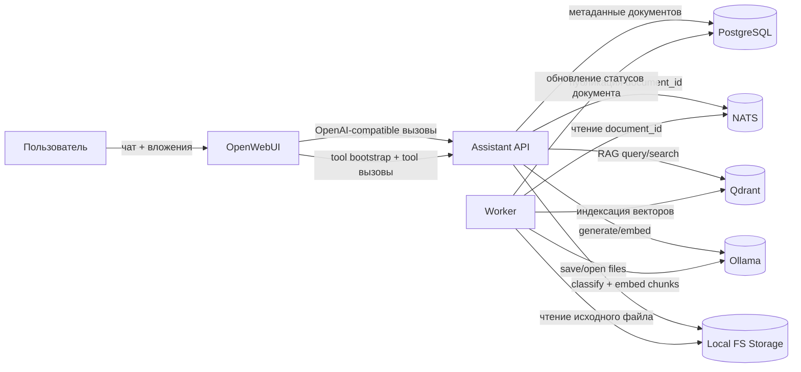
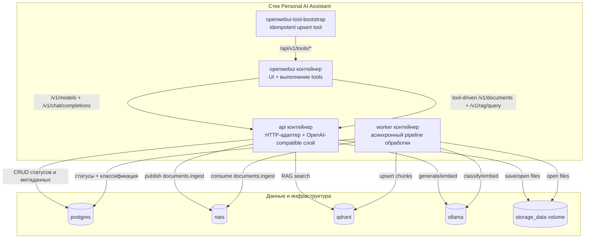
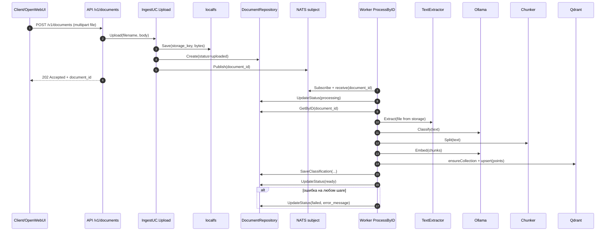
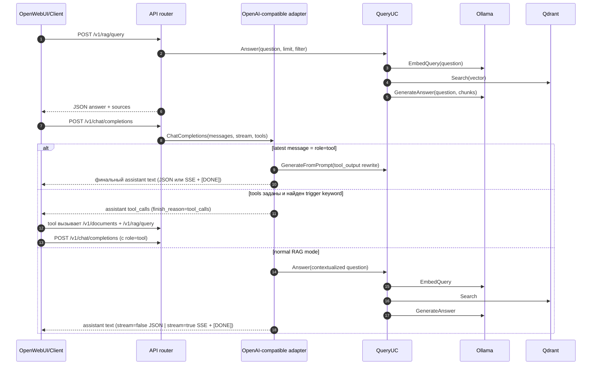
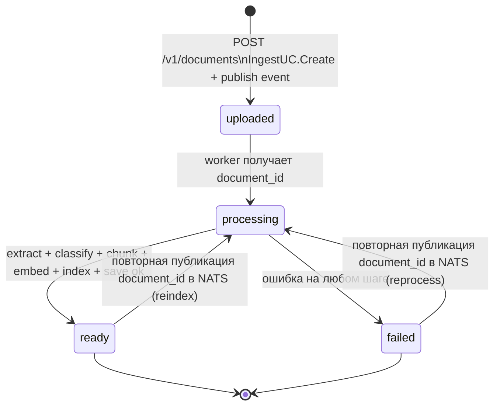

# Архитектура и карта бизнес-логики

## Назначение и аудитория
Этот документ описывает фактическую бизнес-логику и пайплайн данных Personal AI Assistant на основе текущей реализации в репозитории.

Для кого:
- backend-разработчики, которые входят в проект;
- ML/GenAI-ученик, которому нужна целостная модель ingestion + RAG;
- сопровождающие инженеры, которые разбирают инциденты между API, worker и инфраструктурой.

Входит в документ:
- архитектура и runtime-взаимодействия;
- асинхронный ingestion-процесс и синхронные query/chat-потоки;
- интеграция OpenWebUI tool и варианты деплоя.

Не входит:
- изменение API-контрактов или поведения кода.

## Глоссарий
- `IngestUC`: use case, который сохраняет загруженный файл, создает метаданные и публикует событие асинхронной обработки.
- `ProcessUC`: use case worker-сервиса, который извлекает текст, классифицирует, чанкует, строит эмбеддинги и индексирует чанки.
- `QueryUC`: use case, который строит эмбеддинг запроса, ищет релевантные чанки в векторной БД и генерирует ответ.
- OpenAI-compatible слой: адаптер `/v1/models` и `/v1/chat/completions` для интеграции с OpenWebUI.
- `tool_calls`: ветка чата, в которой backend просит UI вызвать tool-функцию.
- post-tool: ветка чата, когда в истории есть `role=tool`; backend переформулирует результат tool в финальный ответ ассистента.

## 1) Системный контекст

### Диаграмма


### Что показывает
- Верхнеуровневые границы системы и основные участники.
- Разделение синхронного API-пути и асинхронного worker-пути.

### Когда использовать
- Первый проход при онбординге.
- Быстрая ориентация перед разбором ошибок.

### Якоря исходного кода
- `internal/bootstrap/bootstrap.go`
- `cmd/api/main.go`
- `cmd/worker/main.go`
- `docker-compose.yml`

## 2) Контейнеры и ответственности

### Диаграмма


### Что показывает
- Runtime-контейнеры и ответственность каждого контейнера.
- Точки интеграции с очередью, хранилищем, векторной БД и LLM.

### Когда использовать
- Обсуждение деплоя и эксплуатации.
- Прояснение ownership и границ модулей.

### Якоря исходного кода
- `docker-compose.yml`
- `scripts/openwebui/bootstrap-tool.sh`
- `deploy/openwebui/tools/assistant_ingest_and_query.py`
- `internal/adapters/http/router.go`
- `internal/adapters/http/openai_compat.go`

## 3) Sequence: Ingestion Pipeline (асинхронный)

### Диаграмма


### Что показывает
- Сквозной асинхронный pipeline от загрузки до индексации.
- Где и кем выставляются документные статусы.

### Когда использовать
- Диагностика сценариев `uploaded/processing/ready/failed`.
- Понимание eventual consistency после загрузки файла.

### Якоря исходного кода
- `internal/core/usecase/ingest.go`
- `internal/core/usecase/process.go`
- `internal/infrastructure/storage/localfs/storage.go`
- `internal/infrastructure/extractor/plaintext/extractor.go`
- `internal/infrastructure/queue/nats/queue.go`
- `internal/infrastructure/vector/qdrant/client.go`

## 4) Sequence: Query и Chat Pipeline (sync + tool branches)

### Диаграмма


### Что показывает
- Единая картина для `/v1/rag/query` и `/v1/chat/completions`.
- Ветки `tool_calls` и post-tool внутри OpenAI-compatible чата.

### Когда использовать
- Разбор отличий поведения JSON/SSE в chat endpoint.
- Диагностика условий, при которых backend возвращает `tool_calls`.

### Якоря исходного кода
- `internal/adapters/http/router.go`
- `internal/adapters/http/openai_compat.go`
- `internal/core/usecase/query.go`
- `deploy/openwebui/tools/assistant_ingest_and_query.py`

## 5) State Diagram: Жизненный цикл документа

### Диаграмма


### Что показывает
- Канонические статусы документа и событийные переходы.
- Путь повторной обработки/переиндексации через повторное событие ingest.

### Когда использовать
- Разбор инцидентов со “зависшими” документами.
- Runbook для реиндексации после смены embedding-модели.

### Якоря исходного кода
- `internal/core/domain/document.go`
- `internal/core/usecase/ingest.go`
- `internal/core/usecase/process.go`
- `internal/infrastructure/repository/postgres/document_repository.go`

## 6) Deployment View (CPU vs Host-GPU runtime)

### Диаграмма
```mermaid
flowchart LR
    subgraph CPUProfile[Профиль A: docker-compose.yml (CPU Ollama в Docker)]
        API1[api]
        WK1[worker]
        OW1[openwebui]
        OL1[ollama/ollama:0.6.0]
        API1 --> OL1
        WK1 --> OL1
        OW1 --> API1
    end

    subgraph HostGPUProfile[Профиль B: docker-compose.host-gpu.yml (GPU Ollama на хосте)]
        API2[api]
        WK2[worker]
        OW2[openwebui]
        PX[ollama service = nginx reverse proxy]
        HOST[Host Ollama GPU process]
        API2 --> PX
        WK2 --> PX
        PX -->|proxy_pass + Host: localhost:11434| HOST
        OW2 --> API2
    end
```

### Что показывает
- Два поддерживаемых runtime-профиля при одинаковой app-логике.
- Критичная деталь host-GPU режима, предотвращающая `403 Forbidden`.

### Когда использовать
- Настройка окружения.
- Диагностика различий между CPU-режимом и host-GPU режимом.

### Якоря исходного кода
- `docker-compose.yml`
- `docker-compose.host-gpu.yml`
- `deploy/ollama-host-proxy/nginx.conf.template`

## Сквозной walkthrough
### Путь загрузки документа
1. Клиент загружает файл через `POST /v1/documents`.
2. API сохраняет бинарник в local FS volume и метаданные в PostgreSQL.
3. API публикует `document_id` в NATS.
4. Worker получает событие и выполняет pipeline обработки.
5. Worker пишет вектора в Qdrant и выставляет `ready` (или `failed`).

### Путь ответа на вопрос
1. Клиент вызывает `POST /v1/rag/query` или `POST /v1/chat/completions`.
2. Query-поток строит эмбеддинг запроса, ищет чанки в Qdrant и генерирует ответ.
3. API возвращает текст ответа и, при необходимости, source/debug-метаданные.

### Путь OpenWebUI tool (вложения)
1. Custom tool в OpenWebUI читает вложения через OpenWebUI file API.
2. Tool загружает каждый файл в `/v1/documents`.
3. Tool опрашивает `/v1/documents/{id}` до `ready/failed`.
4. Tool вызывает `/v1/rag/query` и возвращает агрегированный результат по файлам.

## Типовые сбои
- `ollama embed status: 403 Forbidden`:
  - Часто проявляется в host-GPU режиме, когда upstream отклоняет Host header.
  - Митигируется reverse-proxy с `Host: localhost:11434`.
- `qdrant search status: 400 Bad Request`:
  - Обычно это mismatch размерности эмбеддингов (размер вектора коллекции не совпадает с моделью).
  - Митигируется реиндексацией в коллекцию с корректной размерностью.

## Операционные заметки
### Запуск CPU vs Host-GPU
- CPU-профиль:
  - `docker compose up -d --build`
- Host-GPU-профиль:
  - `docker compose -f docker-compose.yml -f docker-compose.host-gpu.yml up -d --build`

### Health и логи
- API:
  - `GET /healthz`
  - `docker compose logs api`
- Worker:
  - `docker compose logs worker`
- OpenWebUI и tool bootstrap:
  - `docker compose logs openwebui`
  - `docker compose logs openwebui-tool-bootstrap`
- Qdrant и Ollama:
  - `docker compose logs qdrant`
  - `docker compose logs ollama`

## Public API / interfaces / types
Этот документ не вносит изменений в API и типы.
Он описывает существующие контракты:
- `GET /v1/models`
- `POST /v1/chat/completions`
- `POST /v1/documents`
- `GET /v1/documents/{document_id}`
- `POST /v1/rag/query`

## Acceptance Checklist
- Coverage completeness: покрыты ingestion, query, chat tool-calls и post-tool ветки.
- Traceability: у каждой диаграммы есть привязка к конкретным файлам кода.
- Mermaid syntax: все диаграммы оформлены корректными Mermaid-блоками.
- Reader test:
  - понятно, где создается `uploaded` и кто переводит в `ready/failed`;
  - понятно, где происходят `embed` и `search`;
  - понятно, чем отличаются `CPU in Docker` и `host-GPU` runtime.
- No behavior change: изменение только документации.
