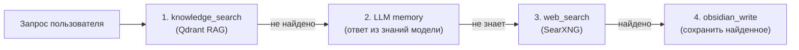
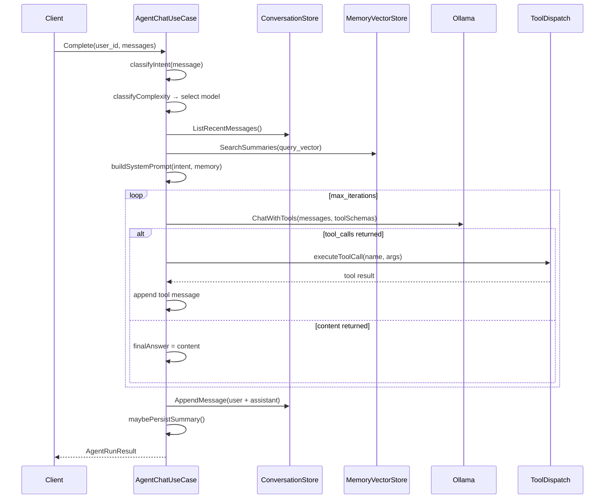

# Level 3 — Agent Loop

## Описание

Серверный agent loop с native function calling. Каскадный поиск: база знаний → память LLM → веб-поиск. Адаптивный выбор модели по сложности запроса. Краткосрочная и долгосрочная память.

## Component Diagram

```mermaid
flowchart TB
    subgraph AgentSystem["Agent Loop (API Server)"]
        AgentChat["AgentChatUseCase\n─────────\nComplete()\nmain loop: planner → tools → persist"]
        IntentCls["IntentClassifier\n─────────\nkeyword + LLM\ngeneral/search/code/creative"]
        ComplexCls["ComplexityClassifier\n─────────\nrule-based + LLM\nsimple/complex/code"]
        ModelRouter["ModelRouter\n─────────\nadaptive model selection\nby complexity tier"]
        ToolCache["ToolResultCache\n─────────\ndedup repeated calls\nTTL per tool"]
        Guardrails["Guardrails\n─────────\ncode safety checks\nfor execute_python/bash"]
    end

    subgraph Tools["Tool Dispatch"]
        KS["knowledge_search\n→ QueryUseCase"]
        WS["web_search\n→ SearXNG"]
        OW["obsidian_write\n→ ObsidianNoteWriter"]
        TT["task_tool\n→ TaskStore CRUD"]
        MCPTool["MCP tools\n→ MCPToolRegistry"]
    end

    subgraph Memory["Memory System"]
        ShortMem["ConversationStore\n─────────\nPostgreSQL\nrecent messages"]
        LongMem["MemoryVectorStore\n─────────\nQdrant\nsemantic summaries"]
        MemStore["MemoryStore\n─────────\nPostgreSQL\nsummary metadata"]
    end

    AgentChat --> IntentCls
    AgentChat --> ComplexCls
    ComplexCls --> ModelRouter
    AgentChat --> ToolCache
    AgentChat --> Guardrails

    AgentChat -->|"ChatWithTools()"| LLM["Ollama / Cloud LLM"]
    AgentChat --> KS & WS & OW & TT & MCPTool

    AgentChat -->|"load history"| ShortMem
    AgentChat -->|"semantic search"| LongMem
    AgentChat -->|"persist summary"| MemStore
    AgentChat -->|"index summary"| LongMem
```

## Каскадный поиск

## Key Flow: Agent Complete()

## Якоря исходного кода

| Компонент | Файл |
|-----------|------|
| AgentChatUseCase | `internal/core/usecase/agent_chat.go` |
| IntentClassifier | `internal/core/usecase/intent.go` |
| ComplexityClassifier | `internal/core/usecase/complexity.go` |
| ToolResultCache | `internal/core/usecase/tool_cache.go` |
| Guardrails | `internal/core/usecase/guardrails.go` |
| ToolHelpers | `internal/core/usecase/tool_helpers.go` |
| ModelRouter | `internal/infrastructure/llm/routing/routing.go` |
| ConversationRepo | `internal/infrastructure/repository/postgres/conversation_repository.go` |
| MemoryRepo | `internal/infrastructure/repository/postgres/memory_repository.go` |
| MemoryVectorStore | `internal/infrastructure/vector/qdrant/memory_client.go` |
