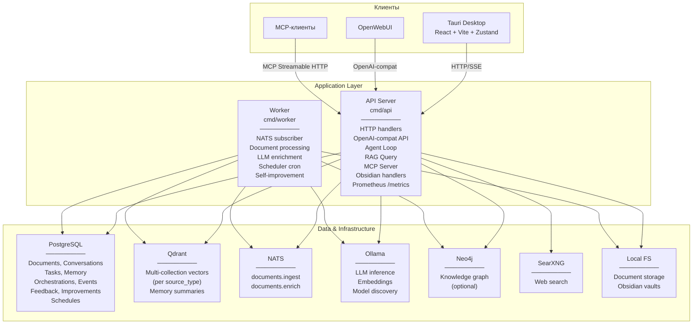

# Level 2 — Containers

## Описание

PAA состоит из двух Go-бинарников (API и Worker), десктопного приложения на Tauri и инфраструктурных сервисов. Гексагональная архитектура (Ports & Adapters).

## Диаграмма

## Контейнеры

| Контейнер | Технология | Ответственность |
|-----------|-----------|----------------|
| API Server | Go (`cmd/api`) | HTTP handlers, agent loop, RAG query, MCP server, metrics |
| Worker | Go (`cmd/worker`) | NATS subscriber, document processing, enrichment, scheduler, self-improve |
| Tauri Desktop | Rust + React/Vite | Chat UI, Obsidian browser, settings, dashboard, graph |
| PostgreSQL | PostgreSQL 16 | Реляционное хранилище состояния |
| Qdrant | Qdrant | Векторный поиск (multi-collection) |
| NATS | NATS | Асинхронная очередь задач |
| Ollama | Ollama | LLM + embeddings |
| Neo4j | Neo4j 5 | Граф знаний (опционально) |
| SearXNG | SearXNG | Веб-поиск |

## Якоря исходного кода

| Компонент | Файл |
|-----------|------|
| API Router | `internal/adapters/http/router.go` |
| Worker main | `cmd/worker/main.go` |
| Bootstrap | `internal/bootstrap/bootstrap.go` |
| Docker Compose | `docker-compose.yml` |
| Tauri App | `ui/src/App.tsx` |
