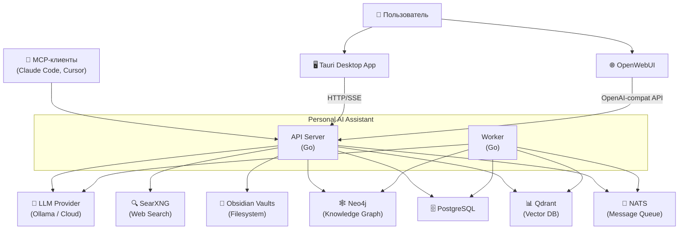

# Level 1 — System Context

## Описание

PAA — AI-ассистент с каскадным поиском, интеграцией с Obsidian и десктопным UI. Взаимодействует с пользователями через Tauri-приложение, OpenWebUI и MCP-клиенты.

## Диаграмма

## Внешние актёры

| Актёр | Описание |
|-------|----------|
| Пользователь | Работает через Tauri UI или OpenWebUI |
| MCP-клиенты | Claude Code, Cursor — подключаются через MCP-протокол |

## Внешние системы

| Система | Назначение |
|---------|-----------|
| LLM Provider | Ollama (self-hosted), OpenRouter, Groq, Together, Cerebras, HuggingFace |
| SearXNG | Self-hosted метапоисковик для web search |
| Obsidian Vaults | Локальные файлы заметок пользователя |
| Neo4j | Граф знаний (опционально) |

## Якоря исходного кода

| Компонент | Файл |
|-----------|------|
| API Server | `cmd/api/main.go` |
| Worker | `cmd/worker/main.go` |
| Bootstrap | `internal/bootstrap/bootstrap.go` |
| Docker Compose | `docker-compose.yml` |
