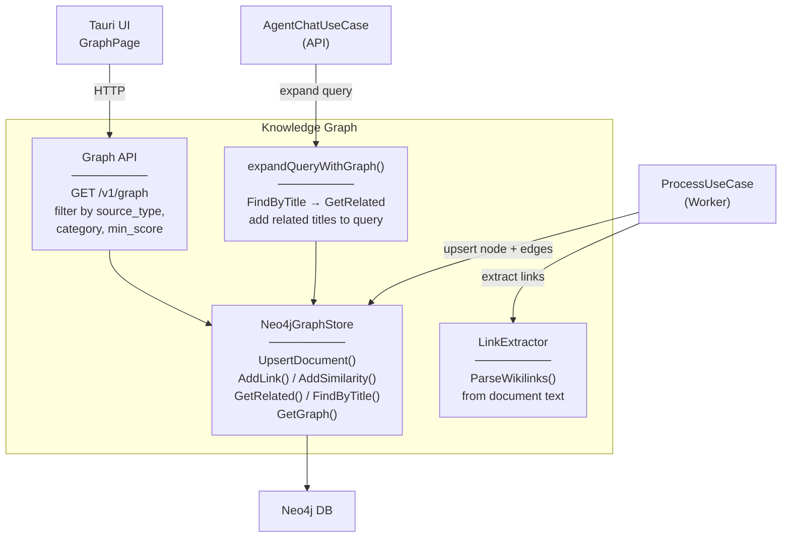

# Level 3 — Knowledge Graph

## Описание

Граф знаний на Neo4j. Извлечение wikilinks из документов, вычисление семантической близости, расширение поисковых запросов через связи графа. Опциональный компонент (GRAPH_ENABLED).

## Component Diagram

## Якоря исходного кода

| Компонент | Файл |
|-----------|------|
| Neo4jGraphStore | `internal/infrastructure/graph/neo4j/client.go` |
| LinkExtractor | `internal/core/usecase/links.go` |
| Query expansion | `internal/core/usecase/agent_chat.go:expandQueryWithGraph` |
| NoopGraphStore | `internal/infrastructure/graph/noop.go` |
| Graph API handler | `internal/adapters/http/router.go` |
