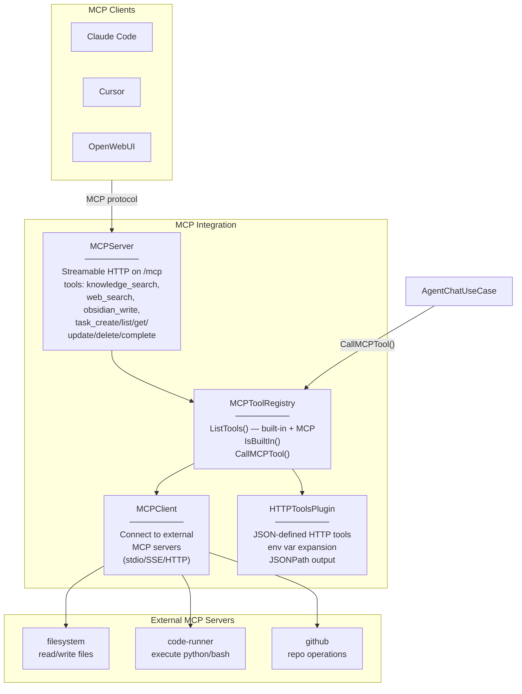

# Level 3 — MCP Integration

## Описание

Двусторонняя MCP-интеграция: PAA выступает как MCP-сервер (для Claude Code, Cursor, OpenWebUI) и как MCP-клиент (подключается к внешним серверам: filesystem, code-runner, GitHub). Дополнительно: JSON-defined HTTP API tools.

## Component Diagram

## Якоря исходного кода

| Компонент | Файл |
|-----------|------|
| MCPServer | `internal/infrastructure/mcp/server.go` |
| MCPClient | `internal/infrastructure/mcp/client.go` |
| MCPToolRegistry | `internal/infrastructure/mcp/registry.go` |
| HTTPToolsPlugin | `internal/infrastructure/mcp/http_tools.go` |
| MCP ports | `internal/core/ports/mcp.go` |
