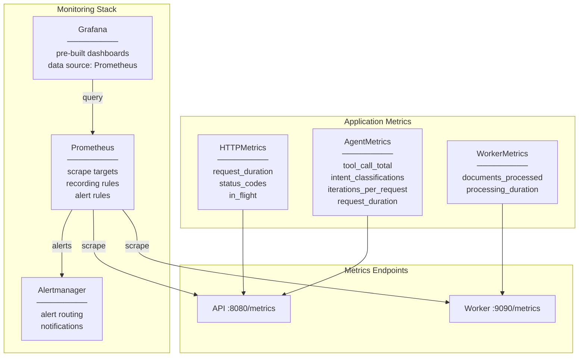

# Level 3 — Monitoring

## Описание

Observability-стек: Prometheus metrics (API + Worker), Grafana dashboards, Alertmanager. Метрики: HTTP requests, agent tool calls, document processing, LLM latency.

## Component Diagram

## Якоря исходного кода

| Компонент | Файл |
|-----------|------|
| HTTPMetrics | `internal/observability/metrics/http.go` |
| AgentMetrics | `internal/observability/metrics/agent_metrics.go` |
| WorkerMetrics | `internal/observability/metrics/worker.go` |
| Prometheus config | `deploy/monitoring/prometheus/` |
| Grafana dashboards | `deploy/monitoring/grafana/dashboards/` |
| Alertmanager config | `deploy/monitoring/alertmanager/` |
