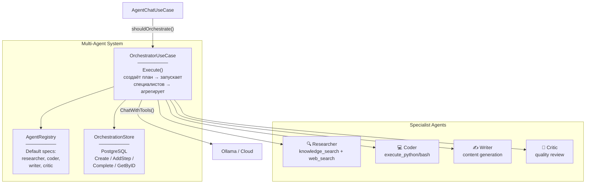

# Level 3 — Multi-Agent Orchestration

## Описание

Динамический оркестратор с конфигурируемыми агентами-специалистами (researcher, coder, writer, critic). Разделяемая память через Qdrant. Персистентная история в PostgreSQL. Активируется для сложных задач (ORCHESTRATOR_ENABLED).

## Component Diagram

## Якоря исходного кода

| Компонент | Файл |
|-----------|------|
| OrchestratorUseCase | `internal/core/usecase/orchestrator.go` |
| AgentRegistry | `internal/core/usecase/agent_registry.go` |
| OrchestrationStore | `internal/infrastructure/repository/postgres/orch_repo.go` |
