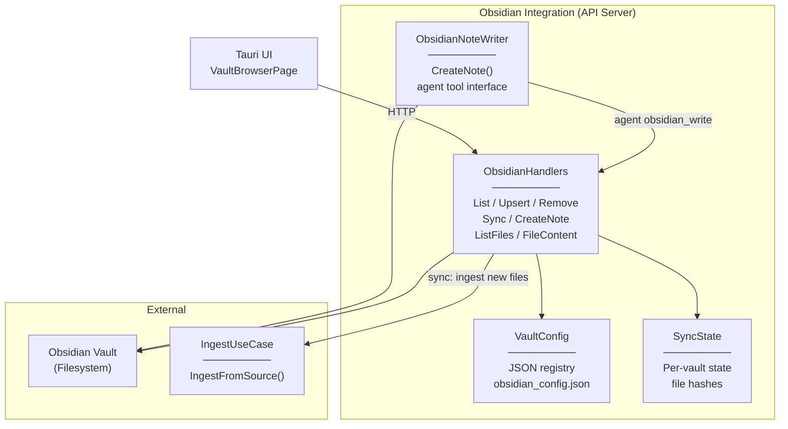
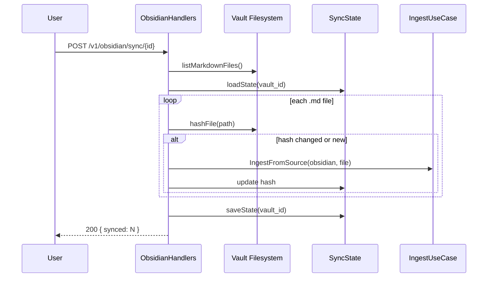

# Level 3 — Obsidian Integration

## Описание

Управление Obsidian vault: регистрация, синхронизация (ручная/автоматическая), создание заметок через агента, браузер файлов. Vault-конфигурация хранится в JSON-файлах.

## Component Diagram

## Key Flow: Vault Sync

## Якоря исходного кода

| Компонент | Файл |
|-----------|------|
| ObsidianHandlers | `internal/adapters/http/obsidian_handlers.go` |
| ObsidianAdapter | `internal/infrastructure/source/obsidian/adapter.go` |
| IngestUseCase | `internal/core/usecase/ingest.go` |
