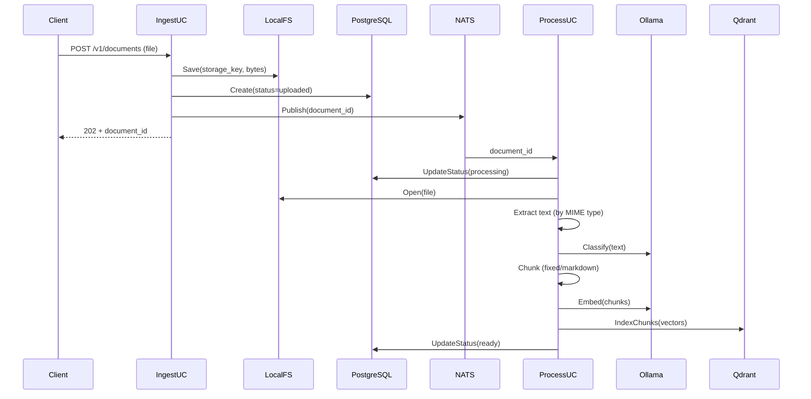
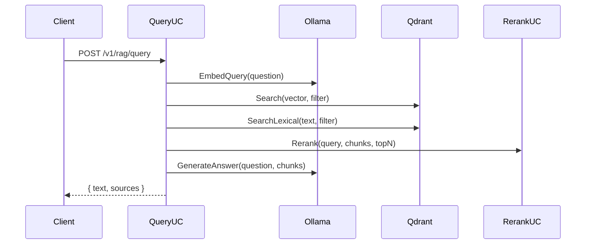

# Level 3 — RAG Pipeline

## Описание

Retrieval-Augmented Generation — ядро системы. Загрузка документов из нескольких источников, асинхронная обработка (extract → classify → chunk → embed → index), гибридный поиск с reranking, генерация ответа.

## Component Diagram

```mermaid
flowchart TB
    subgraph API["API Server"]
        IngestUC["IngestUseCase\n─────────\nUpload()\nIngestFromSource()"]
        QueryUC["QueryUseCase\n─────────\nAnswer()\nSearch + Rerank + Generate"]
        QueryFusion["QueryFusionUseCase\n─────────\nMulti-query expansion"]
        RerankUC["RerankUseCase\n─────────\nCross-encoder scoring"]
    end

    subgraph Worker["Worker"]
        ProcessUC["ProcessUseCase\n─────────\nProcessByID()\nextract → classify →\nchunk → embed → index"]
        EnrichUC["EnrichUseCase\n─────────\nAsync LLM enrichment"]
    end

    subgraph Sources["Source Adapters"]
        UploadSrc["UploadAdapter\nsource_type: upload"]
        WebSrc["WebAdapter\nsource_type: web\nHTML → text"]
        ObsSrc["ObsidianAdapter\nsource_type: obsidian\n(stub)"]
    end

    subgraph Extractors["Extractor Registry"]
        TxtExt["PlaintextExtractor\ntext/plain, text/markdown"]
        PdfExt["PDFExtractor\napplication/pdf"]
        DocxExt["DOCXExtractor\napplication/vnd.openxmlformats"]
        SpreadExt["SpreadsheetExtractor\nxlsx, csv"]
        MetaExt["MetadataExtractor\nfrontmatter, headers"]
    end

    subgraph Chunking["Chunker Registry"]
        FixedChunk["FixedSizeChunker\ndefault"]
        MarkdownChunk["MarkdownChunker\nfor obsidian"]
    end

    IngestUC --> UploadSrc & WebSrc & ObsSrc
    IngestUC -->|"save file"| FS["Local FS"]
    IngestUC -->|"create doc"| PG["PostgreSQL"]
    IngestUC -->|"publish"| NATS["NATS"]

    ProcessUC -->|"open file"| FS
    ProcessUC --> TxtExt & PdfExt & DocxExt & SpreadExt
    ProcessUC --> MetaExt
    ProcessUC --> FixedChunk & MarkdownChunk
    ProcessUC -->|"classify + embed"| Ollama["Ollama"]
    ProcessUC -->|"index vectors"| Qdrant["Qdrant"]
    ProcessUC -->|"save status"| PG

    QueryUC -->|"embed query"| Ollama
    QueryUC -->|"search"| Qdrant
    QueryUC --> RerankUC
    QueryUC --> QueryFusion
    QueryUC -->|"generate answer"| Ollama
```

## Key Flows

### Загрузка документа

### Поиск и ответ

## Якоря исходного кода

| Компонент | Файл |
|-----------|------|
| IngestUseCase | `internal/core/usecase/ingest.go` |
| ProcessUseCase | `internal/core/usecase/process.go` |
| QueryUseCase | `internal/core/usecase/query.go` |
| QueryFusionUseCase | `internal/core/usecase/query_fusion.go` |
| RerankUseCase | `internal/core/usecase/rerank.go` |
| EnrichUseCase | `internal/core/usecase/enrich.go` |
| ExtractorRegistry | `internal/infrastructure/extractor/registry.go` |
| ChunkerRegistry | `internal/infrastructure/chunking/registry.go` |
| Source adapters | `internal/infrastructure/source/upload/`, `web/`, `obsidian/` |
| Qdrant client | `internal/infrastructure/vector/qdrant/client.go` |
| Multi-collection | `internal/infrastructure/vector/qdrant/multi_collection.go` |
