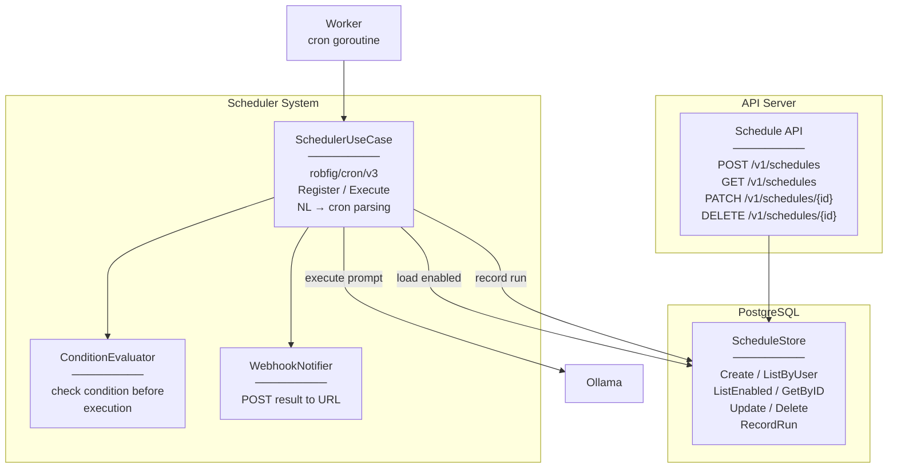

# Level 3 — Scheduled Tasks

## Описание

Cron-планировщик задач с поддержкой natural language → cron, условного выполнения, webhooks. CRUD API для управления расписаниями.

## Component Diagram

## Якоря исходного кода

| Компонент | Файл |
|-----------|------|
| SchedulerUseCase | `internal/core/usecase/scheduler.go` |
| ScheduleStore | `internal/infrastructure/repository/postgres/schedule_repo.go` |
| Schedule API | `internal/adapters/http/router.go` |
