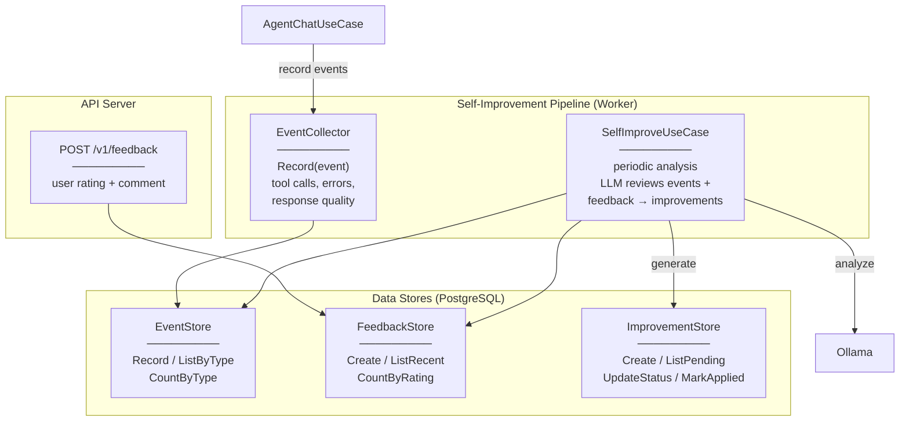

# Level 3 — Self-Improvement

## Описание

Система самоулучшения: сбор событий агента, получение обратной связи от пользователя, периодический LLM-анализ, автоматическое применение безопасных улучшений.

## Component Diagram

## Якоря исходного кода

| Компонент | Файл |
|-----------|------|
| EventCollector | `internal/core/usecase/event_collector.go` |
| SelfImproveUseCase | `internal/core/usecase/self_improve.go` |
| EventStore | `internal/infrastructure/repository/postgres/events_repo.go` |
| FeedbackStore | `internal/infrastructure/repository/postgres/feedback_repo.go` |
| ImprovementStore | `internal/infrastructure/repository/postgres/improvements_repo.go` |
