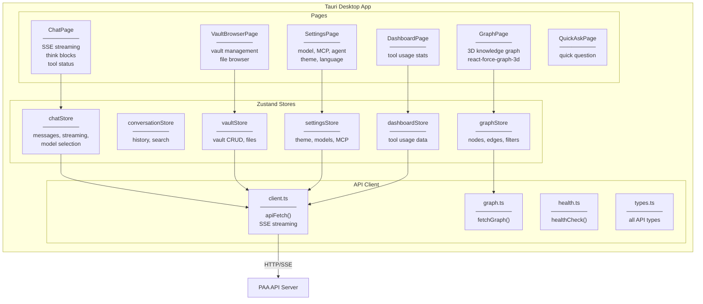

# Level 3 — Tauri Desktop UI

## Описание

Десктопное приложение на Tauri (Rust + React). Chat с SSE streaming, Obsidian browser, settings, dashboard, 3D граф знаний. Zustand для state management, typed API client.

## Component Diagram

## Якоря исходного кода

| Компонент | Файл |
|-----------|------|
| App + routing | `ui/src/App.tsx` |
| ChatPage | `ui/src/pages/ChatPage.tsx` |
| VaultBrowserPage | `ui/src/pages/VaultBrowserPage.tsx` |
| SettingsPage | `ui/src/pages/SettingsPage.tsx` |
| DashboardPage | `ui/src/pages/DashboardPage.tsx` |
| GraphPage | `ui/src/pages/GraphPage.tsx` |
| API client | `ui/src/api/client.ts` |
| Types | `ui/src/api/types.ts` |
| Stores | `ui/src/stores/` |
